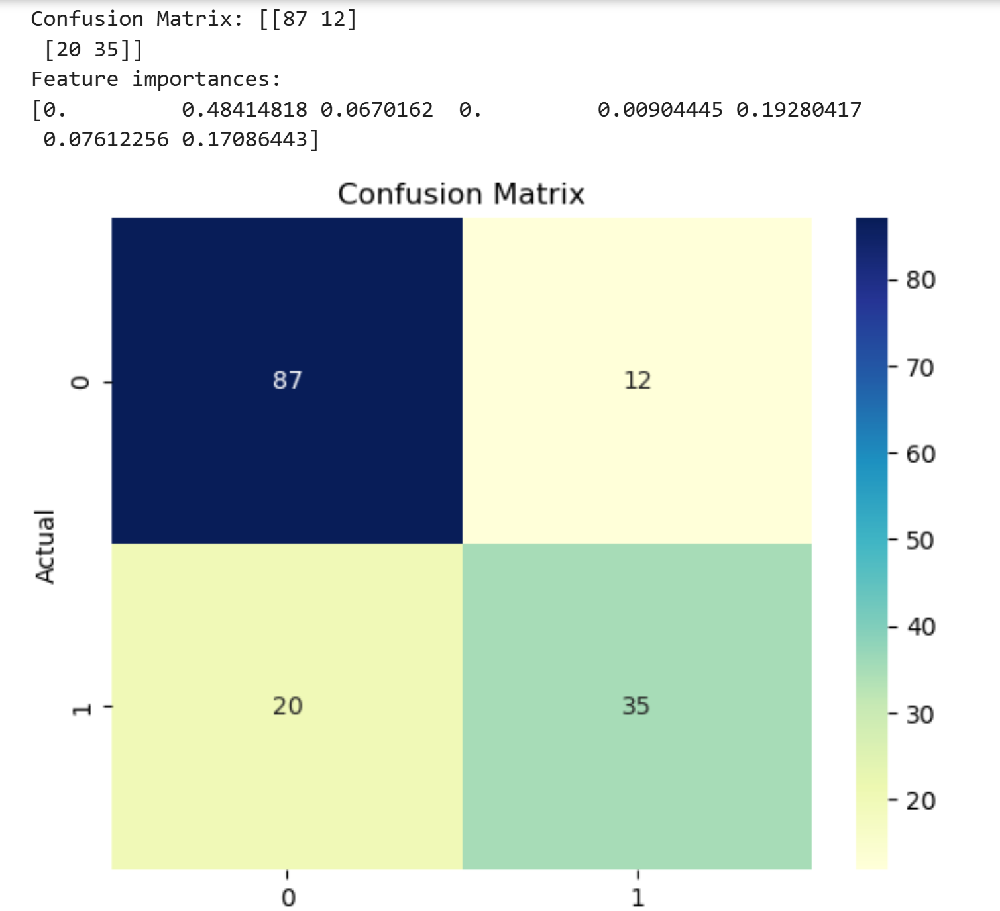
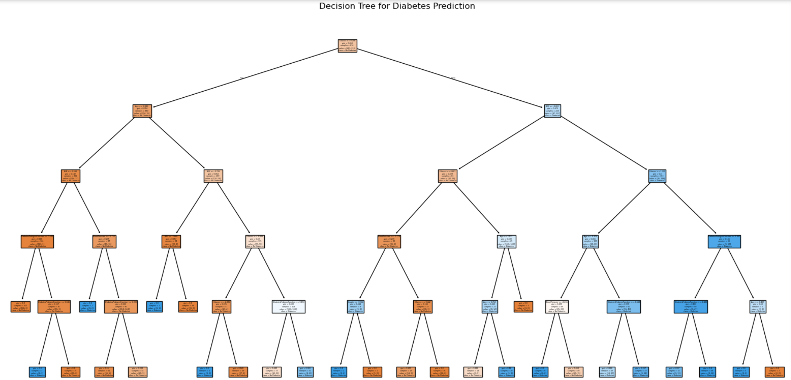
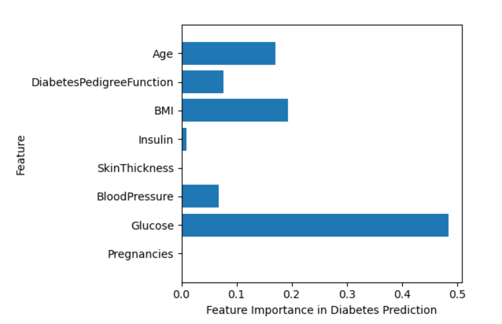
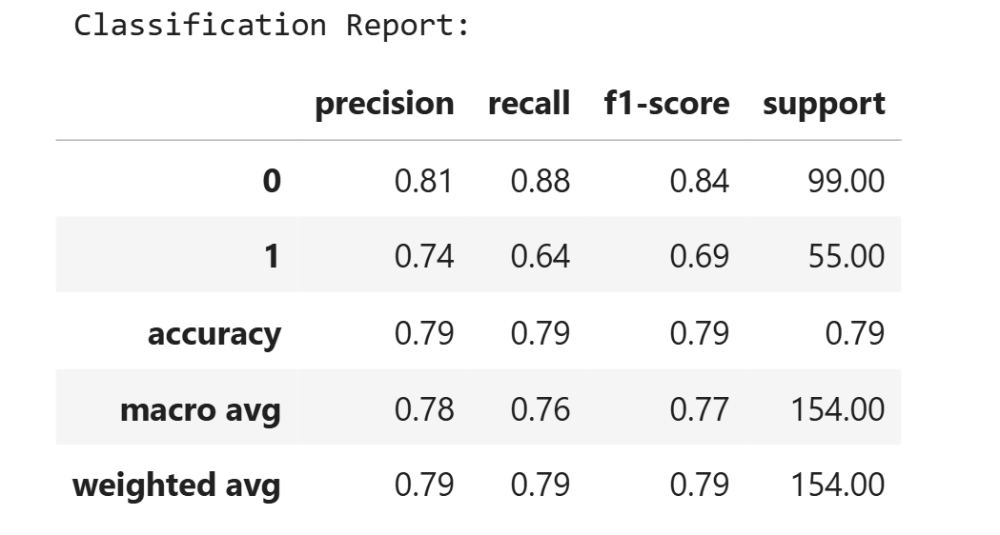

## Table of Contents

- [Supervised Learning Projects](#supervised-learning-projects)
  - [1. K-Nearest Neighbors Classification - Handwritten Digits](#1-k-nearest-neighbors-classification---handwritten-digits)
  - [2. K-Nearest Neighbors Regression - California Housing](#2-k-nearest-neighbors-regression---california-housing)
  - [3. Regression_models_comparison](#3-Regression-Model-Comparison)
  - [4. Logistic Regression Classification](#4-logistic-regression-classification)
  - [5. Linear SVM Classification - Banknote Authentication](#5-linear-svm-classification)
  - [6. Naive Bayes Classification - Gaussian Algorithm](#6-Naive-Bayes-Classification)
  - [7. Heart Disease Logistic Regression](#7-heart-disease-logistic-regression)
  - [8. Diabetes Prediction Decision Tree](#8-Diabetes-Prediction-Decision-Tree)
  - [9. Diabetes Random Forest](#9-Diabetes-Radom-Forest)
  - [10. Diabetes Gradient Boosting](#10-Diabetes-Gradient-Boosting)
  - [11. Diabetes Model Comparison)(#11-Diabetes-Model-Comparison)

## Supervised Learning Projects

This repository contains a collection of hands-on projects using **supervised learning** algorithms in Python. Each project demonstrates key concepts in **classification** and **regression**, using scikit-learn and real-world or built-in datasets. The notebooks are designed for learning, exploration, and visualization.

## How to Run

1. Clone the repository:
   ```bash
   git clone https://github.com/nilooeli/Supervised_Learning.git
   cd Supervised_Learning/supervised_algorithms

## Requirements

- Python 3.4
- Jupyter Notebook
- scikit_learn
- pandas
- numpy
- matplotlib

## 1. K-Nearest Neighbors Classification - Handwritten Digits

*Notebook:* [knn_digits.ipynb](supervised_algorithms/knn_digits.ipynb)

*Description:* This project utilizes the K-Nearest Neighbors (KNN) algorithm to classify handwritten digits using the MNIST dataset. The goal is to accurately predict digit labels based on pixel data.

## 2. K-Nearest Neighbors Regression - California Housing

*Notebook:* [knn_regression.ipynb](supervised_algorithms/knn_regression.ipynb)

*Description:* This project applies the KNN regression technique to predict California housing prices based on various features such as location, size, and demographics.

## 3. Regression Model Comparison

*Notebook:* [regression_models_comparison.ipynb](supervised_algorithms/regression_models_comparison.ipynb)

*Description:* This project compares Linear Regression, Ridge, Lasso, and Elasticnet regression models to understand their performance differences. It provides insights into regularization techniques and their impact on model accuracy. Includes side-by-side results for easy comparison.

## 4. Logistic Regression Classification

*Notebook:* [logistic_regression_classification.ipynb](supervised_algorithms/logistic_regression_classification.ipynb)

*Description:* This project employs logistic regression to perform binary classification tasks. It demonstrates the application of logistic regression on a chosen dataset to predict categorical outcomes.

## 5. Linear SVM Classification

*Notebook:* [linear_svm_banknote_classification.ipynb](supervised_algorithms/linear_svm_banknote_classification.ipynb)

*Description:* This project demonstrate how to use a **Linear Support Vector Machine(SVM)** to classify banknotes as **authentic or forged** using the [UCI Banknote Authentication Dataset](https://archive.ics.uci.edu/ml/datasets/banknote+authentication).

## 6. Naive Bayes Classification

*Notebook:* [Naive_Bayes_Classification.ipynb](supervised_algorithms/Naive_Bayes_Classification.ipynb)

*Description:* This project demonstrates the implementation of the Naive Bayes classification algorithm using the Gaussian algorithm. This notebook includes data exploration, model training, evaluation, and visualization of results.

## 7. Heart Disease Logistic Regression

*Notebook:* [Heart_Disease_Logistic_Regression.ipynb](supervised_algorithms/Heart_Disease_Logistic_Regression.ipynb)

*Description:* This project employs logistic regression to predict the presence of heart disease in patients. Using a dataset with various health indicators, this model classifies individuals as either at risk or not at risk for heart disease. 

## 8. Diabetes Prediction Decision Tree

*Notebook:* [Diabetes_Prediction_Decision_Tree.ipynb](Diabetes_Prediction/Diabetes_Prediction_Decision_Tree.ipynb)

**Description:**  
This project develops a Decision Tree model to predict the likelihood of a patient having diabetes based on specific health metrics, utilizing the Pima Indian Diabetes Database.

---

### Dataset

- **Name:** Pima Indian Diabetes Dataset
- **Source:** [UCI Machine Learning Repository](https://www.kaggle.com/datasets/uciml/pima-indians-diabetes-database)  
- **Samples:** 768 rows × 9 columns  
- **Target variable:** `Outcome` (0 = No Diabetes, 1 = Diabetes)  
- **Features:**  
  - Pregnancies  
  - Glucose  
  - BloodPressure  
  - SkinThickness  
  - Insulin  
  - BMI  
  - DiabetesPedigreeFunction  
  - Age

> The dataset is included as `diabetes.csv` in this repository.

---

### 📊 Model Accuracy
**Test Accuracy:** 79.2%  
*Evaluated using a confusion matrix and classification metrics.*

---

### 🧩 Confusion Matrix



*Figure: Confusion Matrix showing true vs. predicted classifications.*

---

### 🌳 Decision Tree Plot



*Figure: Visualization of the trained Decision Tree used for prediction.*

---

### ⭐ Feature Importance



*Figure: Feature importance scores showing which variables influenced the model most.*

---

### 🧾 Classification Report



*Figure: Detailed performance report including precision, recall, and F1-score.*

## 9. Diabetes Random Forest
## 10. Diabetes Gradient Boosting
## 11. Diabetes Model Comparison (Decision Tree Random Forest, Gradient Boosting)

*Notebook:* [diabetes_model_comparison.ipynb](supervised_algorithms/diabetes_model_comparison.ipynb)

*Description:*  This notebook compares the performance of three models:
- Decision Tree
- Random Forest 
- Gradient Boosting

The notebook includes:
- Training each model on scaled data
- Calculating evaluation metrics: accuracy, precision, recall, F1 score, and ROC AUC
- Plotting ROC curves of all three models on one figure
- Automatically identifying the best model(s) using ROC AUC
- Markdown explanations for all metrics and plots


      
      


     
# Author:
# Niloo Eli
